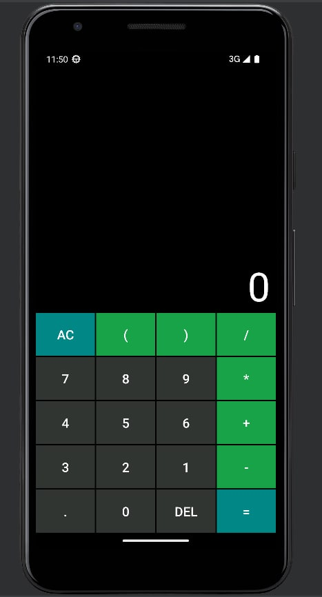

# Android-Calculator-Java
First my Android app on java and Android Studio. I did use reverse polish notation (File Calcularor) for this calculator.

import the files into your project and build it via gradle.

**Calculator loock:**

